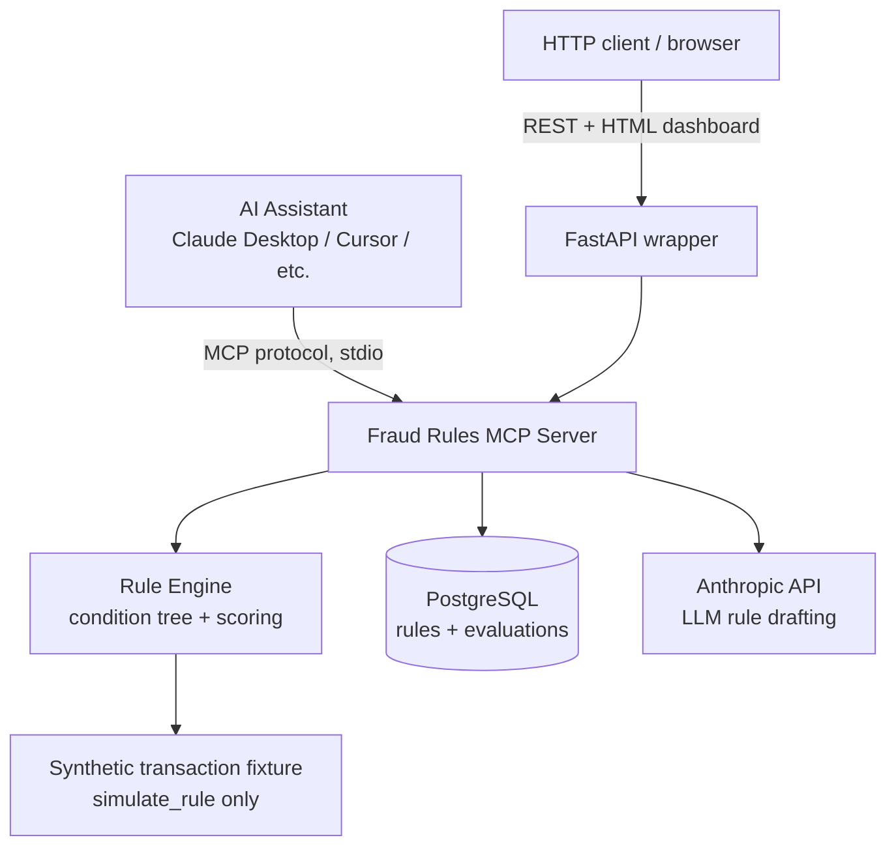
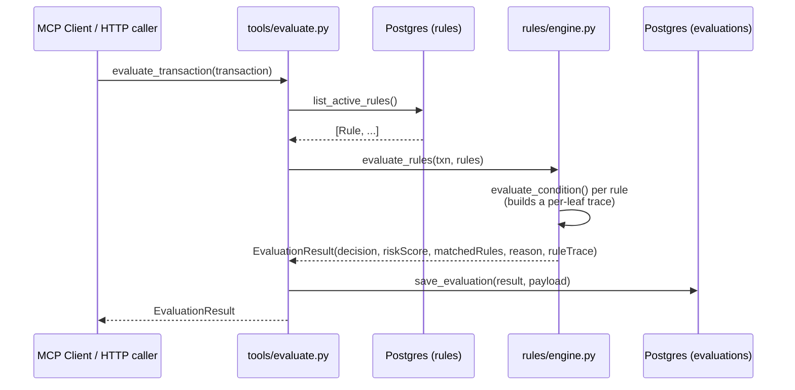
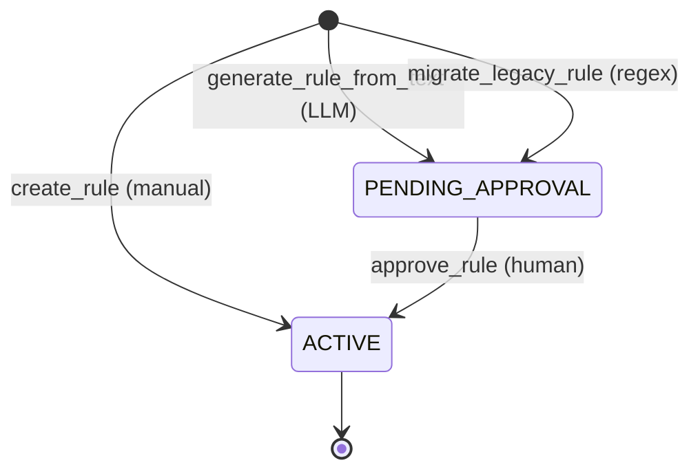

# Architecture

## Overview



The MCP server (`mcp_server.py`) is the single source of truth: it owns all 7
tools. The FastAPI app (`api.py`) is a thin HTTP facade that imports the same
`tools/*` functions — there is no duplicated business logic between the two
entry points.

## Request flow: evaluating a transaction



`explain_decision` later reads straight out of the `evaluations` table — it never
re-runs the rule engine, it just renders the `rule_trace` that was captured at
evaluation time. That's what makes explanations reproducible for audit purposes.

## Rule condition format

Rules are never evaluated with `eval()`. Every condition is a structured JSON
tree of combinators (`all_of` / `any_of`) over leaf comparisons:

```json
{
  "all_of": [
    { "field": "amount", "operator": ">", "value": 5000 },
    { "field": "country", "operator": "!=", "value": { "ref": "customer.country" } }
  ]
}
```

- **Leaf**: `{field, operator, value}`. `field` is drawn from a fixed whitelist
  (`amount`, `country`, `merchant`, `customerAge`, `deviceRisk`, `transactionId`,
  `customer.country`). `value` is either a literal or a `{"ref": "..."}` pointer
  to another field on the same transaction (so rules can compare two fields,
  e.g. transaction country vs. home country).
- **Combinator**: `all_of` (AND) / `any_of` (OR) over child nodes, nestable.

`create_rule` accepts this as a human-friendly DSL string
(`"amount > 10000 AND country != CA"`), compiled by a hand-rolled
recursive-descent parser (`rules/condition_dsl.py`) — a fixed field whitelist, a
fixed operator set (`> < >= <= == !=`), and simple string splitting. `AND` binds
tighter than `OR` (no parentheses in v1).

Every node evaluation produces a `ConditionTrace` alongside the boolean result,
so `explain_decision` can say exactly which sub-conditions were true.

## Scoring and decision

Each rule carries an `action` (`DECLINE` / `REVIEW` / `ALERT` / `HIGH_RISK`) and
a `severity_weight` (defaults: DECLINE=60, REVIEW/ALERT=30, HIGH_RISK=20,
override-able per rule).

```
riskScore = min(100, sum(severity_weight of every matched ACTIVE rule))

decision =
    DECLINE  if any matched rule's action is DECLINE
    REVIEW   else if any matched rule's action is REVIEW or ALERT
    APPROVE  otherwise
```

Deterministic and fully attributable to specific rules — no ML black box.

## Governance workflow for AI-authored and migrated rules



Rules created by `create_rule` (a human explicitly wrote the DSL) go straight to
`ACTIVE`. Rules produced by `generate_rule_from_text` or `migrate_legacy_rule` are
**not** trusted automatically — they land as `PENDING_APPROVAL` and only affect
real evaluations after `approve_rule` is called. This mirrors how a real fraud
platform would gate AI-authored or auto-migrated logic behind human review.

`generate_rule_from_text` uses the Anthropic API's structured-output mode
(`messages.parse(..., output_format=RuleDraft)`), so the model's response is
schema-validated against the same `ConditionNode` shape the rule engine consumes
— it cannot return malformed conditions.

`migrate_legacy_rule` is intentionally **not** LLM-based: it's a deterministic
regex + field/operator lookup table (`rules/legacy_migration.py`) converting
text like `IF TX_AMT > 5000 AND CNTRY <> HOME_CNTRY SET FRAUD_FLAG=Y` into the
same DSL the rest of the system uses. Migration correctness for a compliance
system needs to be reproducible, not probabilistic.

## Simulation

`simulate_rule` dry-runs a candidate rule (never stored) against a bundled
synthetic historical dataset (`data/synthetic_transactions.json`, 300
transactions with a ground-truth `is_fraud` label, generated by
`data/generate_synthetic_transactions.py` with fraud-correlated features so the
metrics are meaningful) and reports:

- `transactionsTested`
- `blocked` — how many transactions the rule would have matched
- `falsePositives` — matched transactions that were not actually fraud
- `estimatedFraudPrevented` — sum of amounts for matched transactions that *were* fraud

This lets a rule be impact-tested before `create_rule`/`approve_rule` ever puts
it in front of real traffic.

## Data model

```
rules
  id, name, condition_dsl, condition_json (JSONB),
  action, severity_weight, priority,
  status      (ACTIVE | PENDING_APPROVAL | DISABLED)
  source      (MANUAL | LLM_GENERATED | MIGRATED)
  created_at, updated_at

evaluations
  id, transaction_id, payload (JSONB), decision, risk_score,
  matched_rules (JSONB), reason, rule_trace (JSONB), evaluated_at
```

`database/repo.py` is the only module that talks SQLAlchemy — every tool
function goes through it, so both `mcp_server.py` and `api.py` share one data
access layer.

## Directory layout (Python implementation)

```
python-mcp-server/
  mcp_server.py       MCP stdio server, registers all 7 tools
  api.py              FastAPI wrapper (REST + HTML dashboard) over the same tools/*
  dashboard.py         server-rendered HTML for the "/" dashboard route
  docker-compose.yml   Postgres only; app runs locally against it
  tools/               one function per MCP tool
  rules/               condition_dsl.py, condition_tree.py, engine.py, legacy_migration.py
  models/              schemas.py (Pydantic), db_models.py (SQLAlchemy)
  database/            session.py, repo.py, seed.py
  data/                seed_rules.json, synthetic_transactions.json + generator
  tests/               pytest: DSL parsing, engine scoring, migration, tools, mocked LLM call
  client_smoke_test.py  drives all 7 tools over real MCP stdio, for end-to-end verification
```

## Directory layout (Java implementation)

```
java-mcp-server/
  src/main/java/com/frauddemo/fraudmcp/
    FraudMcpServerApplication.java   single @SpringBootApplication; behavior toggled by profile
    engine/          ConditionNode, ConditionDslParser, ConditionTreeEvaluator, RuleEngine,
                     SimulationService -- ports of rules/*.py, same JSON condition-tree shape
    migration/       LegacyRuleMigrator -- port of legacy_migration.py
    model/           domain DTOs (Rule, EvaluationResult, Transaction, SimulationReport,
                     ExplanationResult) + JPA entities (RuleEntity, EvaluationEntity)
    repository/      RuleJpaRepository, EvaluationJpaRepository, RuleDataService (facade,
                     mirrors database/repo.py -- the only class that talks Spring Data JPA)
    llm/             AnthropicRuleGenerator, RuleDraft/ConditionNodeDraft/ConditionValueDraft
                     (strict-typed LLM structured-output schema, see note below)
    mcp/             FraudRuleTools -- the 7 @McpTool-annotated methods, auto-registered by
                     spring-ai-starter-mcp-server
    web/             FraudRuleController (REST facade) + DashboardController/DashboardHtml
    config/          JacksonConfig (see note below)
  src/main/resources/
    application.properties          default profile: web server + REST/dashboard
    application-stdio.properties    stdio profile: web server off, console logging off
    db/migration/    V1__init.sql (schema), V2__seed_rules.sql (5 starter rules)
    data/synthetic_transactions.json  same fixture file as the Python side, for parity
  docker-compose.yml  Postgres on port 5433 (Python's is 5432 -- both can run simultaneously)
```

### Java-specific implementation notes

A few genuine surprises surfaced building the Spring Boot 4 / Spring AI 2.0 version that are
worth calling out (both fixed and verified working):

- **Two Jackson majors coexist on the classpath.** Spring Boot 4 switched its own JSON engine
  to Jackson 3 (`tools.jackson.*`), while the MCP SDK and Anthropic SDK still depend on classic
  Jackson 2 (`com.fasterxml.jackson.*`). No `com.fasterxml.jackson.databind.ObjectMapper` bean is
  auto-configured anymore -- `config/JacksonConfig` provides one explicitly for our own code
  (`Transaction.toMap`, `SimulationService`'s fixture loading).
- **`spring-ai-mcp-annotations` and `anthropic-java-core` need different major versions of
  `com.github.victools:jsonschema-generator`** (5.x vs 4.x) for their own internal reflective
  schema derivation. Maven can only resolve one version, and each library's compiled bytecode
  calls a method signature only its own major version has -- pinning either version breaks the
  other. `AnthropicRuleGenerator` sidesteps this entirely by hand-writing the JSON schema for
  `RuleDraft`/`ConditionNodeDraft`/`ConditionValueDraft` and passing it via the raw
  `OutputConfig`/`JsonOutputFormat` API instead of the SDK's `outputConfig(Class<T>)`
  auto-derivation, which is what actually invokes the conflicting code path.
- **Jackson bean-property inference bites nullable boolean predicates.** `ConditionNode` briefly
  had `isLeaf()`/`isCombinator()` helper methods; Jackson's default bean introspection treats
  `isXxx()` as a getter for a property named `xxx`, so Hibernate's JSON round-trip (which
  serializes then deserializes to deep-copy JSONB-typed fields) wrote out a `"leaf"` field
  nothing could read back in. Removed as dead code rather than annotated around, since nothing
  used them.
- **`TestRestTemplate` needs a module Boot 4's test starter doesn't pull in by default**
  (`spring-boot-restclient`, for `RestTemplateBuilder`). The integration test uses `MockMvc`
  instead, which doesn't have this gap and is the more common choice for controller tests anyway.
