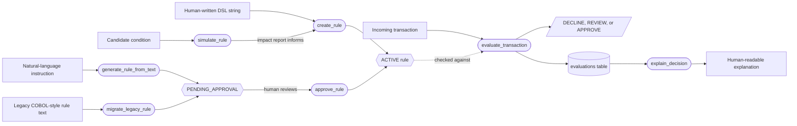

# Fraud Rules MCP Server

An MCP (Model Context Protocol) server that lets an AI assistant — Claude Desktop,
Cursor, or any other MCP client — author, evaluate, simulate, explain, and migrate
fraud-detection rules for payment transactions.

It turns natural-language instructions like *"Block suspicious payments from new
devices over $5000"* into structured, auditable fraud rules, evaluates real
transactions against them, and explains every decision down to which individual
condition fired.

## Why this exists

Fraud rule engines (Mastercard's decisioning platform, IBM ODM, and similar systems)
combine four things that are usually built separately: a deterministic rule engine,
LLM-assisted rule authoring, pre-deployment impact simulation, and compliance-grade
explainability. This project implements all four end-to-end, plus a deterministic
migration path from legacy rule text — the same shape of problem as modernizing an
existing fraud platform.

See [ARCHITECTURE.md](ARCHITECTURE.md) for how the pieces fit together.

## Implementations

| Directory | Stack | Status |
|---|---|---|
| [`python-mcp-server/`](python-mcp-server/) | Python, FastAPI, MCP SDK, PostgreSQL, Docker | Complete |
| [`java-mcp-server/`](java-mcp-server/) | Java 21, Spring Boot 4, Spring AI MCP, PostgreSQL, Docker | Complete |

Both implementations expose the same 7 MCP tools and condition-tree rule format,
so they're directly comparable.

## The 7 MCP tools

| Tool | Purpose |
|---|---|
| `evaluate_transaction` | Score a transaction against all ACTIVE rules → decision, risk score, matched rules, reason |
| `create_rule` | Author a rule directly from a DSL condition string (e.g. `amount > 10000 AND country != CA`) |
| `generate_rule_from_text` | Draft a rule from a natural-language instruction via the Anthropic API (stored `PENDING_APPROVAL`) |
| `approve_rule` | Human-in-the-loop gate — activates a `PENDING_APPROVAL` rule |
| `explain_decision` | Render a compliance-friendly explanation for a previously evaluated transaction |
| `simulate_rule` | Dry-run a candidate rule against historical transactions before deploying it |
| `migrate_legacy_rule` | Deterministically convert legacy COBOL-style rule text into the modern rule format |

## Tool flow

How the 7 tools connect: three ways to author a rule, one governance gate, and one
evaluation loop that everything else supports.



Only `create_rule` puts a rule live immediately — a human wrote it. Rules from
`generate_rule_from_text` or `migrate_legacy_rule` always land as `PENDING_APPROVAL`
and need `approve_rule` before `evaluate_transaction` will ever consider them.
`simulate_rule` never touches this state machine at all: it tests a condition against
300 historical transactions without storing anything, so a rule's real-world impact
is known *before* it's authored for real.

## Quick start (Python implementation)

```bash
cd python-mcp-server
pip install -r requirements.txt

# start Postgres
docker compose up -d

# seed the 5 starter rules
python -m database.seed

# option A: run as an MCP stdio server (for Claude Desktop / Cursor / MCP Inspector)
python mcp_server.py

# option B: run the HTTP + dashboard wrapper
python -m uvicorn api:app --port 8010
# then open http://127.0.0.1:8010/ for the rules/evaluations dashboard,
# or http://127.0.0.1:8010/docs for the interactive API
```

Copy `python-mcp-server/.env.example` to `.env` and set `ANTHROPIC_API_KEY` to use
`generate_rule_from_text`.

### Verify it end-to-end

```bash
cd python-mcp-server
python -m pytest tests/            # unit + DB integration tests
python client_smoke_test.py        # exercises all 7 tools over real MCP stdio
```

## Quick start (Java implementation)

```bash
cd java-mcp-server

# start Postgres (separate instance, port 5433, so both stacks can run at once)
docker compose up -d

# option A: run as an MCP stdio server (for Claude Desktop / Cursor / MCP Inspector)
./mvnw spring-boot:run -Dspring-boot.run.profiles=stdio

# option B: run the HTTP + dashboard wrapper (default profile)
./mvnw spring-boot:run
# then open http://127.0.0.1:8081/ for the rules/evaluations dashboard
```

Set `ANTHROPIC_API_KEY` in your environment to use `generate_rule_from_text`.
Flyway applies the schema and seeds the 5 starter rules automatically on first run.

### Verify it end-to-end

```bash
cd java-mcp-server
./mvnw test              # unit tests (engine/migration) + MockMvc integration tests
```

## Example

```json
// Transaction
{
  "transactionId": "TX12345",
  "amount": 8500,
  "country": "CA",
  "merchant": "CryptoExchange",
  "customerAge": 22,
  "deviceRisk": "HIGH",
  "customer": { "country": "US" }
}
```

```json
// evaluate_transaction result
{
  "decision": "DECLINE",
  "riskScore": 100,
  "matchedRules": ["RULE-002", "RULE-001", "RULE-005"],
  "reason": "Device risk was HIGH; Merchant category was CryptoExchange; Amount (8500.0) > threshold (5000); Transaction country (CA) differs from customer's home country (US)"
}
```

## License

Personal portfolio project.
